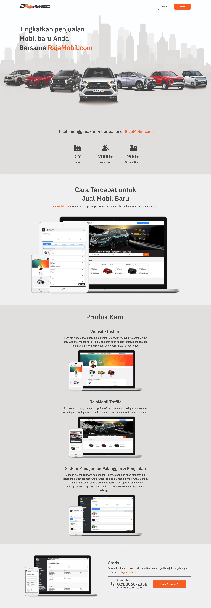
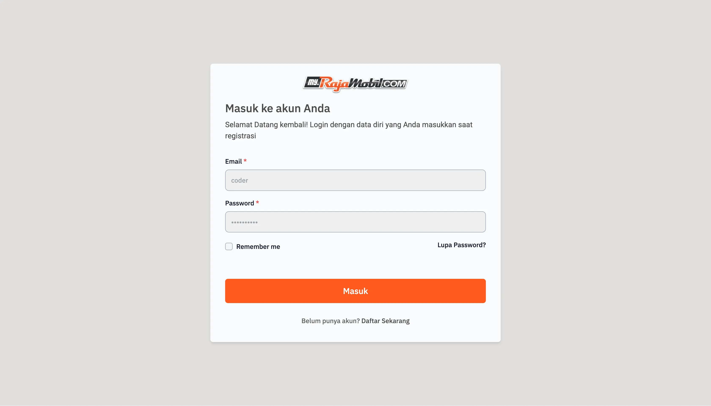
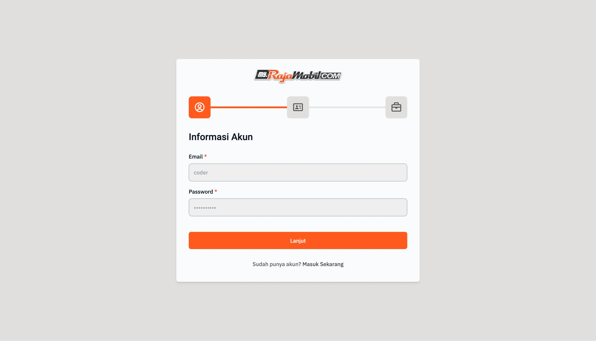
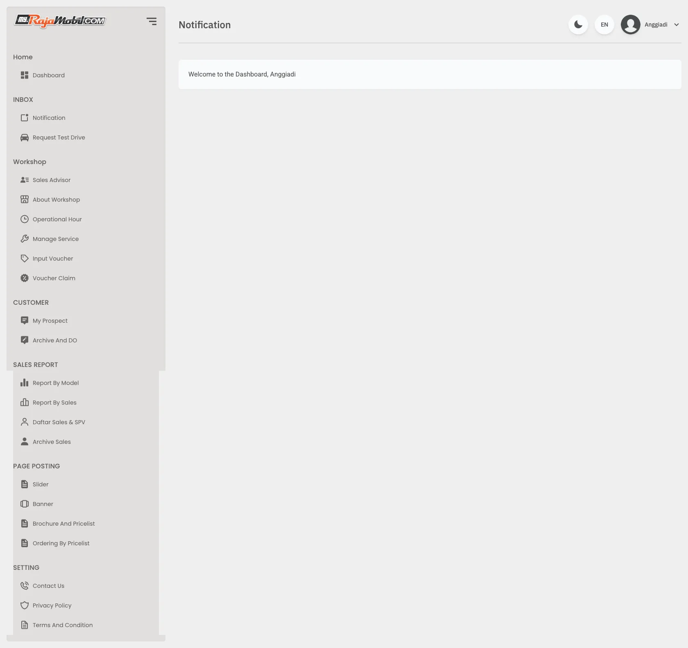

## Display Image

# CMS-MyRajamobil
dashboard cms aplikasi web online showroom

## How to Use Frontend

- npm install
- npm run dev (1x compile)
- npm run watch (compile otomatis setiap ada perubahan)
- edit di file /resources/js

## Before Commit
 - npm run prod

## Database
 - php artisan migrate

note: jangan edit langsung tanpa npm run watch / dev (app.css, main.css, app.js, main.js) -> di folder public